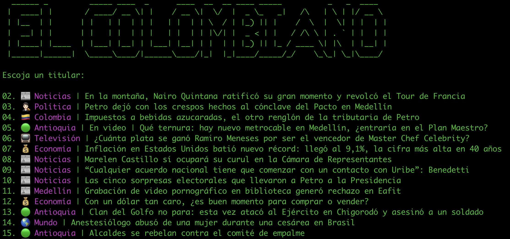
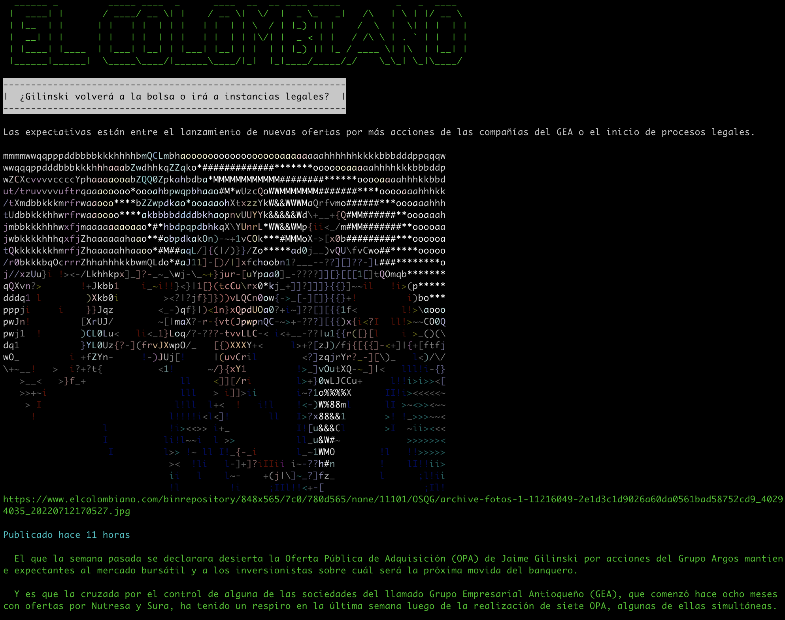

# Readme

Read El Colombiano's front page news from the command line.

**Usage:** `ruby scraper.rb [keyword-to-filter]`

**Example:** `ruby scraper.rb Presidente`

## Mac OS

`brew install imagemagick@6 -s`

`brew unlink imagemagick`

`brew link imagemagick@6 --force`

`gem install rmagick`

## Linux

`sudo apt-get install libmagickwand-dev`

## Possible colors

`[:black, :light_black, :red, :light_red, :green, :light_green, :yellow, :light_yellow, :blue, :light_blue, :magenta, :light_magenta, :cyan, :light_cyan, :white, :light_white, :default]`

# Run

`bundle install`

`ruby scraper.rb`

## Screenshots

